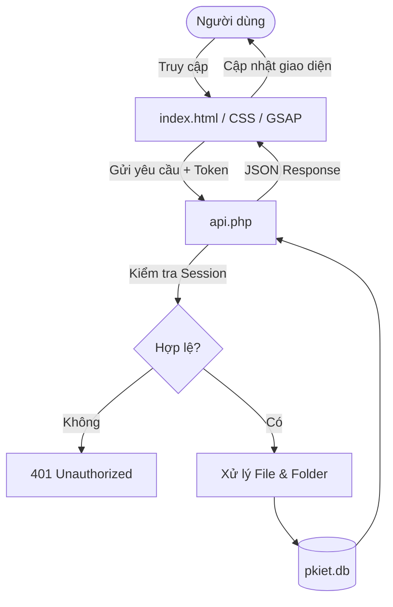
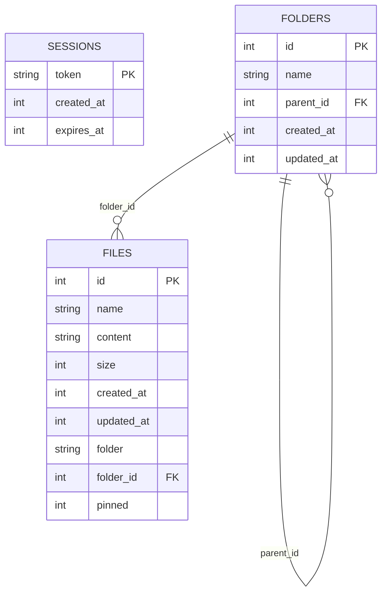

# NOTE CODE/PROMPT

<h1 align="center">
  <br>
  <picture>
    <source media="(prefers-color-scheme: dark)" srcset="https://readme-typing-svg.herokuapp.com?font=Orbitron&height=50&lines=PKIET+%E2%80%94+VAULT;SECURE+STORAGE;CYBERPUNK+DRIVE&color=7C3AED&width=450&center=true">
    
  </picture>
</h1>

<p align="center">
  <b>Hệ thống quản lý và lưu trữ tài liệu trực tuyến (Cloud Vault) giao diện Cyberpunk độc đáo</b>
</p>

<p align="center">
  
  
  
  
</p>

---

## 🚀 Giới Thiệu

**PKIET — Vault** là một ứng dụng Web App lưu trữ, quản lý tệp tin và ghi chú bảo mật cao cấp với phong cách Cyberpunk/Sci-Fi. Hệ thống sử dụng PHP kết hợp SQLite3 nhằm mang lại hiệu năng cao, triển khai đơn giản và dễ bảo trì.

Ứng dụng tích hợp trình soạn thảo Markdown hiện đại hỗ trợ Split View thời gian thực, giúp người dùng vừa chỉnh sửa vừa xem trước nội dung ngay lập tức.

---

## ✨ Tính Năng Nổi Bật

### 🔐 Bảo Mật & Xác Thực

* Hệ thống Session Token thông qua `X-Session-Token`.
* Token được lưu và kiểm soát thời hạn trong cơ sở dữ liệu.
* API trả lỗi theo chuẩn JSON và che giấu thông tin nội bộ.

### 📂 Quản Lý Tệp Tin & Thư Mục Đa Cấp

* Tạo, đổi tên, di chuyển và xóa thư mục đệ quy.
* Hỗ trợ cấu trúc cây thư mục không giới hạn cấp.
* Đồng bộ dữ liệu Legacy sang cấu trúc cây hiện đại.
* Ghim tệp tin quan trọng.

### 📝 Cyberpunk Editor

* Chế độ List View.
* Chế độ Card View.
* Chế độ Quick Note.
* Markdown Split View.
* Resize động bằng `ResizeObserver`.
* Tự động tính toán line wrapping.

### 🎨 UX/UI

* Neon Glow Effects.
* Animated Grid.
* Floating Particles.
* Shake Animation.
* Xuất dữ liệu ZIP bằng JSZip.

---

## 🛠️ Công Nghệ Sử Dụng

### Backend

* PHP 8.0+
* SQLite3
* PDO SQLite
* WAL Mode
* Foreign Keys

### Frontend

* HTML5
* CSS3
* JavaScript ES6+
* GSAP
* GSAP TextPlugin
* JSZip
* JetBrains Mono
* Orbitron

---

## 📊 Kiến Trúc Hệ Thống

### Workflow Diagram



### Database Schema



---

## 📂 Cấu Trúc Thư Mục

```text
pkiet-vault/
├── api.php
├── index.html
└── pkiet.db
```

### Mô Tả

| Tệp        | Chức năng                                |
| ---------- | ---------------------------------------- |
| api.php    | API RESTful, quản lý dữ liệu và xác thực |
| index.html | Giao diện Cyberpunk                      |
| pkiet.db   | SQLite Database                          |

---

## 📦 Cài Đặt

### Yêu Cầu Hệ Thống

* Apache / Nginx / Caddy
* PHP 8.0+
* sqlite3 hoặc pdo_sqlite

### Tải Dự Án

```bash
git clone https://github.com/your-username/pkiet-vault.git
cd pkiet-vault
```

### Cấp Quyền Ghi

```bash
chmod 775 .
touch pkiet.db && chmod 664 pkiet.db
chown -R www-data:www-data .
```

### Khởi Chạy

Mở trình duyệt:

```text
http://localhost/pkiet-vault/index.html
```

Hệ thống sẽ tự động tạo bảng dữ liệu trong lần chạy đầu tiên.

---

## ⚙️ Cấu Hình API

```php
define('DB_PATH', __DIR__ . '/pkiet.db');

header('Access-Control-Allow-Origin: *');
header('Access-Control-Allow-Methods: GET, POST, PUT, DELETE, OPTIONS');
header('Access-Control-Allow-Headers: Content-Type, X-Session-Token');
```

---

## ▶️ Hướng Dẫn Sử Dụng

### 1. Đăng Nhập

Nhập khóa truy cập để tạo phiên làm việc và nhận Session Token.

### 2. Quản Lý Tệp & Thư Mục

* Tạo thư mục mới.
* Tạo tệp mới.
* Điều hướng bằng Breadcrumbs.
* Ghim tệp quan trọng.

### 3. Soạn Thảo

* Chọn tệp để mở Editor.
* Tệp `.md` tự động kích hoạt Markdown Split View.
* Nhấn `Ctrl + S` để lưu.

---

## 🗺️ Roadmap

* [x] Cyberpunk UI
* [x] GSAP Animation
* [x] Recursive Folder Tree
* [x] Markdown Split View
* [ ] End-to-End Encryption (AES-GCM)
* [ ] Drag & Drop Upload
* [ ] Multi-user System

---

## 🤝 Đóng Góp

```bash
git checkout -b feature/AmazingFeature
git commit -m "Add some AmazingFeature"
git push origin feature/AmazingFeature
```

Quy trình:

1. Fork dự án.
2. Tạo nhánh mới.
3. Commit thay đổi.
4. Push lên GitHub.
5. Tạo Pull Request.

---

## 📄 Giấy Phép

Dự án được phát hành theo giấy phép MIT License.

Xem chi tiết tại tệp:

```text
LICENSE
```

---

## 👨‍💻 Tác Giả

**PKIET**

* Prompt engineer
* Backend Development
* Frontend Development
* Cyberpunk UI/UX Design

GitHub: `@kiet1812`
